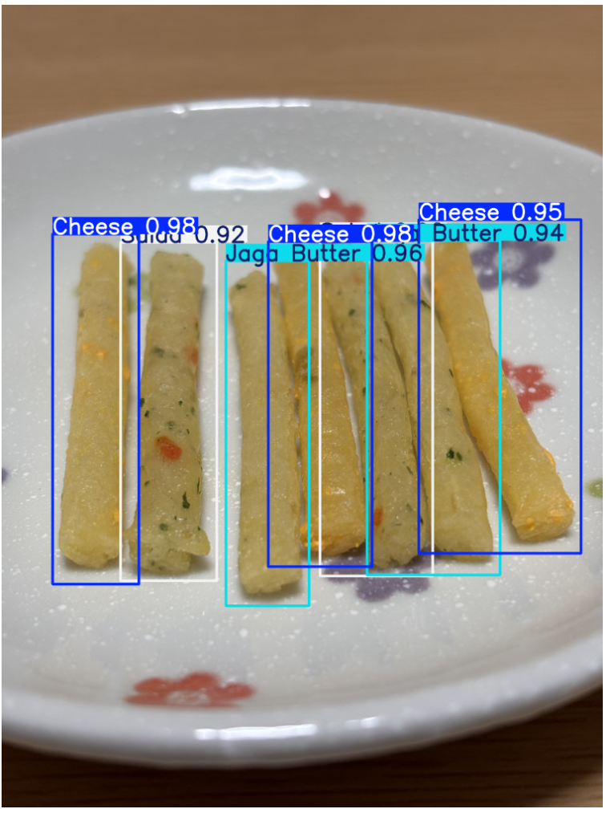

# 🥔 Jagarico Object Detection (YOLOv8)

YOLOv8を用いて「じゃがりこ」の3フレーバーを物体検出するプロジェクト。

- cheese
- jaga_butter
- salad

小規模データ環境（135枚）での検出精度評価と分析を実施。

---

## 🎯 プロジェクト目的

- 小規模データでの物体検出性能検証
- クラス別性能差の分析
- 学習挙動（Loss推移）の可視化
- 改善仮説の立案

---

## 🧠 技術スタック

- Python
- YOLOv8 (Ultralytics)
- PyTorch
- Google Colab (A100 GPU)
- matplotlib
- Roboflow (アノテーション)

---

## 📂 データ概要

- 総画像数：135枚
- クラス数：3
- train/val/test 分割済み
- バウンディングボックス形式アノテーション

---

## ⚙️ 学習設定

- モデル：YOLOv8n
- Epoch：100
- 画像サイズ：640
- バッチサイズ：16

---

# 📊 結果

## 🔹 全体指標

| 指標 | 値 |
|------|------|
| Precision | 0.925 |
| Recall | 0.865 |
| mAP@0.5 | 0.951 |
| mAP@0.5:0.95 | 0.824 |

小規模データながらmAP@0.5で0.95以上を達成。

## 📈 mAP推移


### mAP推移

- mAP@0.5は早期に0.9以上へ到達
- mAP@0.5:0.95も安定上昇

---

## 🔹 クラス別性能

| クラス | Precision | Recall | mAP@0.5 | mAP@0.5:0.95 |
|--------|----------|--------|--------|-------------|
| cheese | 0.964 | 0.848 | 0.980 | 0.869 |
| jaga_butter | 0.928 | 0.779 | 0.922 | 0.765 |
| salad | 0.881 | 0.968 | 0.952 | 0.838 |

---

# 📈 学習挙動分析

## 📉 Train vs Validation Loss


TrainとValidationの乖離は限定的であり、
過学習は軽微と判断。
### Loss推移

- Train / Validationともに減少傾向
- 90〜100epochで収束
- 過学習の兆候は限定的

（ここに results.png を貼る）

---

## 📊 Precision / Recall推移


### Precision / Recall推移

- Precisionは安定的に上昇
- Recallはクラスごとに差あり

---
## 推論結果



---

# 🧠 考察

## 1️⃣ 全体傾向

小規模データにもかかわらず高精度達成。
YOLOv8の事前学習の有効性を確認。

---

## 2️⃣ クラス別差異分析

### jaga_butter

- Recallが低め
→ 見逃しがやや多い

- mAP@0.5:0.95も低い
→ 位置精度がやや不安定

原因仮説：
- cheeseとの視覚的類似
- データ枚数の偏り
- 特徴量の曖昧性

---

### salad

- Recallが非常に高い
→ 検出は安定

- Precisionがやや低め
→ 他クラスと誤検出の可能性

---

# 💡 今後の展開

- FastAPI化
- Streamlitデモアプリ化
- リアルタイム検出への拡張
- 医療物品検出応用への転用検討

---

# 📎 実行方法

```bash
pip install ultralytics
yolo train model=yolov8n.pt data=data.yaml epochs=100 imgsz=640
```

---
